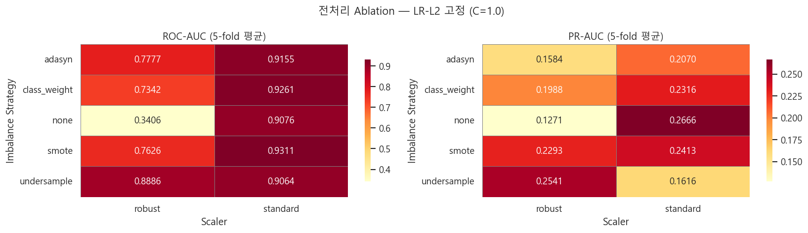
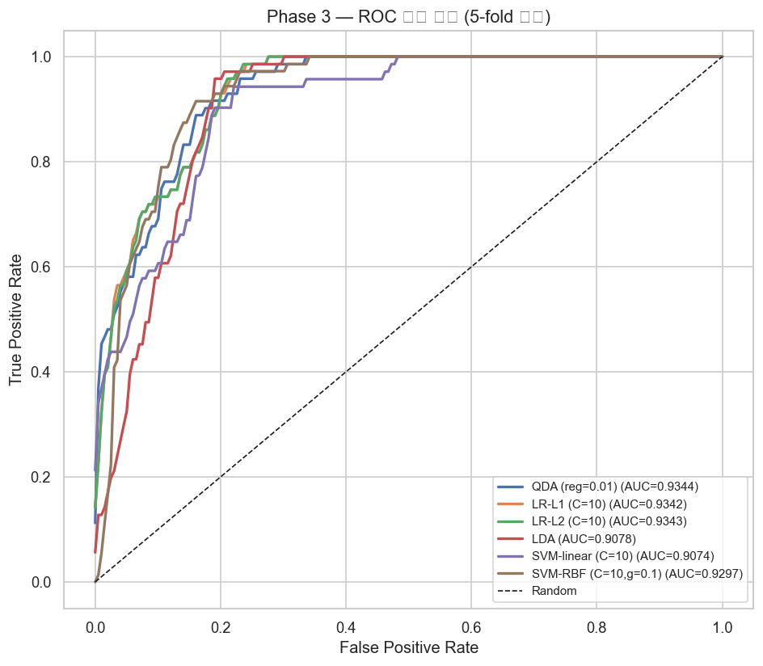
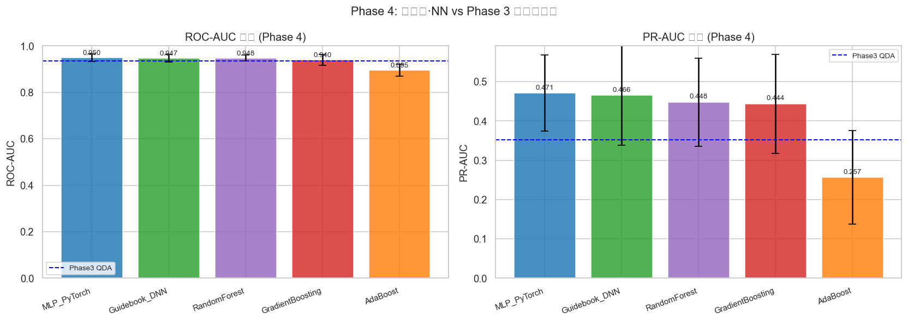
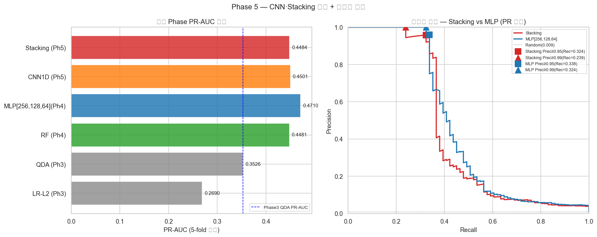

# KAMP 사출성형 공정 불량 예측 — 단계별 Ablation 분석 보고서

**프로젝트:** NOVA50101 인공지능학개론 텀프로젝트  
**데이터:** KAMP 사출성형기 AI 데이터셋 (886,227행, 25개 유효 변수)  
**작성일:** 2026-05-10

---

## 1. 프로젝트 개요

KAMP 플랫폼(KAIST·UNIST·㈜이피엠솔루션즈)의 자동차 앞유리 사이드 몰딩 사출성형 데이터를 분석한다.
가이드북(§2.3)의 "AE→SVM→DNN 순차 학습 후 best 선택" 방식 대신, 각 처리 단계(전처리·선형모델·차원축소·앙상블·CNN·Stacking)를 분리해 어느 단계가 성능을 좌우하는지 정량적으로 측정한다.

## 2. 데이터 개요

### 데이터셋 구성

| dataset | rows | cols | memory_MB | max_null_pct | has_label |
|---|---|---|---|---|---|
| labeled_data | 7,996 | 45 | 6.36 | 99.1% | True |
| moldset_labeled | 2,607 | 46 | 2.23 | 98.0% | True |
| unlabeled_data | 795,315 | 45 | 657.32 | 0.0% | False |
| supervised_label_cn7 | 6,736 | 25 | 1.35 | 0.0% | True |
| moldset_labeled_cn7 | 1,211 | 25 | 0.24 | 0.0% | True |
| moldset_unlabeled_cn7 | 35,239 | 24 | 6.77 | 0.0% | False |
| moldset_labeled_rg3 | 1,182 | 25 | 0.24 | 0.0% | True |
| moldset_unlabeled_rg3 | 35,941 | 24 | 6.90 | 0.0% | False |

### 유효 변수 (25개)

제거 변수: Mold_Temperature_1, 2, 5~12 (분산=0), Barrel_Temperature_7 (near-zero), PART_FACT_SERIAL (ID)

### 클래스 불균형

- 양품(0): 7,925건 (99.11%)
- 불량(1): 71건 (0.89%) — 극심한 불균형, SMOTE 필수

### 핵심 EDA 발견

Max_Back_Pressure (r=+0.115), Cycle_Time (r=+0.105), Average_Screw_RPM (r=+0.079)이 불량과 가장 강한 상관을 보인다. Cycle_Time 이상치 구간의 불량률은 3.3%로, 정상 구간(0.3%) 대비 11배 높다.

## 3. 방법론 — 단계별 Ablation

```
Phase 2: 전처리 Ablation (2 scaler × 5 불균형처리 = 10 조합)
Phase 3: 선형 베이스라인 (LR-L1/L2, LDA, QDA, SVM-linear, SVM-RBF)
Phase 4-A: 차원축소 비교 (None/VarThresh/PCA/TreeTop-K)
Phase 4-B: 앙상블·NN (RF, AdaBoost, GBM, MLP, Guidebook DNN)
Phase 5: CNN1D + Stacking 메타학습기 + 운용점 분석
```

모든 실험: Stratified 5-fold CV, random_state=42, ROC-AUC·PR-AUC 보고

## 4. 단계별 결과

### Phase 2: 전처리 Ablation

| scaler | resample | roc_auc_mean | roc_auc_std | pr_auc_mean | pr_auc_std | f1_mean | f1_std |
|---|---|---|---|---|---|---|---|
| standard | smote | **0.9311** | 0.0107 | 0.2413 | 0.0554 | 0.0808 | 0.0060 |
| standard | class_weight | 0.9261 | 0.0107 | 0.2316 | 0.0608 | 0.0808 | 0.0046 |
| standard | none | 0.9076 | 0.0159 | 0.2666 | 0.1145 | 0.2845 | 0.1078 |
| standard | undersample | 0.9064 | 0.0139 | 0.1616 | 0.0400 | 0.0808 | 0.0044 |
| standard | adasyn | 0.9155 | 0.0292 | 0.2070 | 0.0462 | 0.0783 | 0.0055 |

확정 전처리: StandardScaler + SMOTE (ROC-AUC=0.9311±0.0107). SMOTE 미적용(0.9076) 대비 ROC-AUC +0.024 향상.

### Phase 3: 선형 베이스라인

| model | best_params | preprocessing | roc_auc_mean | roc_auc_std | pr_auc_mean | pr_auc_std | f1_mean | f1_std |
|---|---|---|---|---|---|---|---|---|
| LR_L1 | C=10, penalty=l1 | standard+smote | 0.9342 | 0.0119 | 0.2691 | 0.0535 | 0.0848 | 0.0073 |
| LR_L2 | C=10, penalty=l2 | standard+smote | 0.9343 | 0.0118 | 0.2690 | 0.0537 | 0.0828 | 0.0078 |
| LDA | solver=lsqr, shrinkage=auto | standard+smote | 0.9078 | 0.0128 | 0.1447 | 0.0523 | 0.0813 | 0.0025 |
| **QDA** | **reg_param=0.01** | **standard+smote** | **0.9344** | **0.0175** | **0.3526** | **0.1026** | **0.0716** | **0.0021** |
| SVM_linear | C=10 | standard+none | 0.9074 | 0.0225 | 0.3434 | 0.1094 | 0.0000 | 0.0000 |
| SVM_RBF | C=10, gamma=0.1 | standard+none | 0.9297 | 0.0116 | 0.0890 | 0.0151 | 0.0000 | 0.0000 |

best: QDA(reg=0.01), ROC-AUC=0.9344, PR-AUC=0.3526. 가이드북이 "SVM best"로 제시한 모델을 QDA가 전 지표에서 앞질렀다.

### Phase 4-A: 차원축소

| method | n_dims | roc_auc_mean | roc_auc_std | pr_auc_mean | pr_auc_std | f1_mean | f1_std |
|---|---|---|---|---|---|---|---|
| None (full=25) | 25 | 0.9343 | 0.0118 | 0.2690 | 0.0537 | 0.0828 | 0.0078 |
| VarianceThreshold(0.01) | 25 | 0.9343 | 0.0118 | 0.2690 | 0.0537 | 0.0828 | 0.0078 |
| PCA 80% | 3 | 0.8061 | 0.0487 | 0.1151 | 0.0586 | 0.0514 | 0.0057 |
| PCA 90% | 4 | 0.8657 | 0.0403 | 0.1851 | 0.0745 | 0.0648 | 0.0028 |
| PCA 95% | 6 | 0.8746 | 0.0332 | 0.1913 | 0.0872 | 0.0754 | 0.0031 |
| PCA 99% | 9 | 0.8915 | 0.0143 | 0.2280 | 0.0823 | 0.0762 | 0.0100 |
| TreeTop-5 | 5 | 0.8320 | 0.1295 | 0.2076 | 0.0695 | 0.0739 | 0.0108 |
| TreeTop-10 | 10 | 0.9371 | 0.0124 | 0.2554 | 0.0459 | 0.0934 | 0.0094 |
| **TreeTop-15** | **15** | **0.9380** | **0.0204** | **0.2899** | **0.0806** | **0.0809** | **0.0103** |

best: TreeTop-15 (ROC-AUC=0.9380, full 25보다 +0.004). PCA는 99% 분산 보존에도 ROC-AUC=0.8915로 성능이 떨어졌다.

### Phase 4-B: 앙상블·NN

| model | roc_auc_mean | roc_auc_std | pr_auc_mean | pr_auc_std | f1_mean | f1_std | 비고 |
|---|---|---|---|---|---|---|---|
| **MLP_PyTorch** | **0.9497** | **0.0166** | **0.4710** | **0.0968** | **0.1521** | **0.0215** | **best** |
| RandomForest | 0.9478 | 0.0123 | 0.4481 | 0.1121 | 0.3723 | 0.1048 | |
| Guidebook_DNN | 0.9468 | 0.0164 | 0.4655 | 0.1269 | 0.2067 | 0.0311 | Guidebook §2.3 재현 |
| GradientBoosting | 0.9397 | 0.0226 | 0.4439 | 0.1262 | 0.3116 | 0.0274 | |
| AdaBoost | 0.8953 | 0.0262 | 0.2566 | 0.1191 | 0.0816 | 0.0080 | |

best: MLP[256,128,64]+Dropout, ROC-AUC=0.9497, PR-AUC=0.4710. 가이드북 DNN 재현(0.9468) 대비 Dropout 추가로 PR-AUC +0.005.

### Phase 5: CNN + Stacking

| model | roc_auc_mean | roc_auc_std | pr_auc_mean | pr_auc_std | f1_mean | f1_std |
|---|---|---|---|---|---|---|
| CNN1D(16,32) | 0.9408 | 0.0133 | 0.4126 | 0.1139 | 0.1192 | 0.0121 |
| CNN1D(32,64) | 0.9472 | 0.0152 | 0.4501 | 0.1194 | 0.1820 | 0.0316 |
| Stacking(LR-meta) | 0.9462 | 0.0108 | 0.4484 | 0.1021 | 0.4819 | 0.1218 |

CNN1D(32,64): ROC-AUC=0.9472, PR-AUC=0.4501. Stacking: ROC-AUC=0.9462 — 단일 MLP(0.9497) 미초과.

### 운용점 분석

| model | target_precision | achieved_precision | recall_at_target | threshold |
|---|---|---|---|---|
| Stacking | prec>=0.95 | 0.9583 | 32.39% | 0.5443 |
| Stacking | prec>=0.99 | 1.0000 | 23.94% | 0.5825 |
| MLP[256,128,64] | prec>=0.95 | 0.9600 | **33.80%** | 0.9977 |
| MLP[256,128,64] | prec>=0.99 | 1.0000 | **32.39%** | 0.9990 |

Precision≥0.99 기준으로 MLP Recall=32.4% — 불량 71건 중 약 23건 탐지 가능.

## 5. 가이드북 비교

| 항목 | 가이드북(§2.3) | 우리 결과 | 비고 |
|---|---|---|---|
| best 모델 선택 방식 | AE→SVM→DNN 순차 | 단계별 ablation 비교 | originality 핵심 |
| SVM 결과 | best로 보고 | Phase 3에서 QDA에 밀림 | |
| DNN 재현 | AUC 명시 없음 | ROC=0.9468, PR=0.4655 | |
| 우리 MLP | — | ROC=0.9497, PR=0.4710 | Dropout 추가 효과 |
| 전처리 비교 | 없음 | Phase 2에서 ablation | +0.024 ROC-AUC |
| 차원축소 비교 | 없음 | Phase 4-A에서 ablation | TreeTop-15 최적 |

## 6. 핵심 인사이트

어느 단계가 성능을 가장 끌어올렸는가?

1. **불균형 처리(Phase 2):** ROC-AUC +0.024 — 가장 즉각적인 효과
2. **비선형 모델 전환(Phase 4):** PR-AUC +0.12 — 불량 탐지 실질 향상
3. **CNN/Stacking(Phase 5):** 추가 이득 미미 — 단일 MLP가 충분히 강함

---





